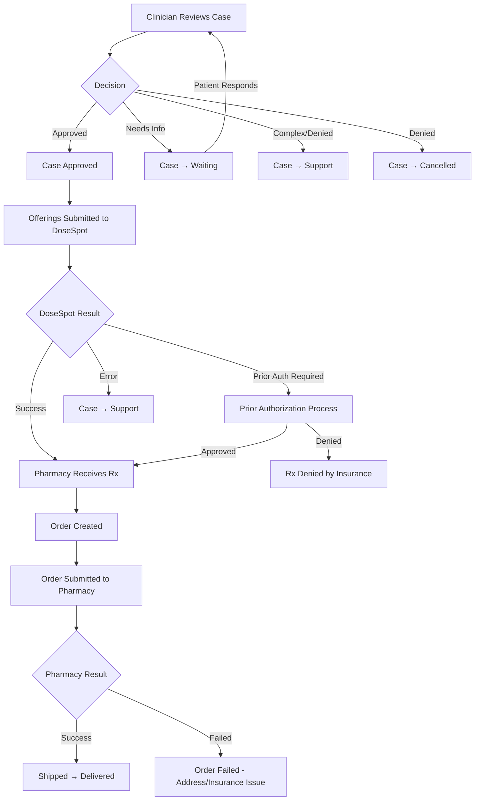

# After the Prescription

The case has been reviewed by a clinician. Now what? This guide covers every outcome path — from a straightforward approval through to pharmacy fulfillment, as well as the less happy paths: denials, prior authorization requests, insurance issues, and failed orders.

Understanding these post-prescription flows is critical if you want to keep your patients informed and your systems in sync. Most partner bugs and support tickets come from misunderstanding what happens in this phase.

## The Decision Tree

After a clinician reviews a case, there are several possible outcomes:



Let's walk through each path.

## Path 1: Approved (The Happy Path)

When a clinician approves a case, things happen in a cascade:

### Step 1: Case status changes to "Approved"

You receive a `case_approved` webhook:

```json
{
  "timestamp": 1666384936,
  "event_type": "case_approved",
  "case_id": "26f3d453-09ff-41cb-9fc6-724d1b77277c",
  "metadata": "Shopify Order #12345"
}
```

At this point, the clinician has reviewed the patient's information and determined the treatment is appropriate. MDI is now preparing to submit prescriptions to DoseSpot.

### Step 2: Offerings are submitted to DoseSpot

Each approved offering (medication/compound/supply) is submitted to DoseSpot for electronic prescribing. You receive an `offering_submitted` webhook for each offering:

```json
{
  "timestamp": 1666384936,
  "event_type": "offering_submitted",
  "case_id": "be2fc48f-df75-4cd7-a78a-89d51cc46e17",
  "metadata": "Shopify Order #12345",
  "offerings": [
    {
      "id": "da78172e-e253-4458-8bc2-6acbd34f28a6",
      "case_offering_id": "da78172e-e253-4458-8bc2-6acbd34f28a6",
      "title": "Semaglutide 2.5mg",
      "name": "Semaglutide",
      "directions": "Inject 0.25mL subcutaneously once weekly",
      "status": "pending",
      "clinical_note": "Start at low dose and titrate up",
      "thank_you_note": "Thank you for choosing our service!"
    }
  ]
}
```

What "submitted" means depends on the offering type:

| Offering Type | What "Submitted" Means |
|--------------|----------------------|
| **DoseSpot medication** | The prescription has been electronically sent to DoseSpot, and the pharmacy has acknowledged receipt. |
| **Boothwyn compound** | The prescription has been sent to the compounding pharmacy and the order has been initiated. |
| **Service** | The service PDF is ready to be downloaded. |

<Note>
  The `offering_submitted` webhook is your most important signal for triggering downstream actions. This is when you should mark the order as "prescribed" in your system, send a confirmation email to the patient, or trigger a payment capture.
</Note>

### Step 3: Case status changes to "Completed"

Once all offerings have been successfully submitted and confirmed, the case moves to "Completed":

```json
{
  "timestamp": 1666384936,
  "event_type": "case_completed",
  "case_id": "26f3d453-09ff-41cb-9fc6-724d1b77277c",
  "metadata": "Shopify Order #12345"
}
```

At this point, the clinical work is done. The prescriptions are at the pharmacy. Now it's about fulfillment.

### Step 4: Order fulfillment

After prescriptions are submitted, orders are created for pharmacy fulfillment. You can list orders and submit them:

<CodeGroup>

```bash cURL
# List orders on the case
curl -X GET https://api.mdintegrations.com/v1/partner/cases/CASE_ID/orders \
  -H "Authorization: Bearer TOKEN"

# Submit an order to the pharmacy
curl -X POST https://api.mdintegrations.com/v1/partner/cases/CASE_ID/orders/ORDER_ID/submit \
  -H "Authorization: Bearer TOKEN"
```

```python Python
import requests

# List orders
orders = requests.get(
    f"https://api.mdintegrations.com/v1/partner/cases/{case_id}/orders",
    headers={"Authorization": "Bearer TOKEN"}
).json()

# Submit each order
for order_group in orders:
    for order in order_group.get("orders", []):
        if order["status"] == "ready":
            requests.post(
                f"https://api.mdintegrations.com/v1/partner/cases/{case_id}/orders/{order['id']}/submit",
                headers={"Authorization": "Bearer TOKEN"}
            )
            print(f"Submitted order {order['id']} to {order_group['pharmacy_name']}")
```

```javascript JavaScript
// List orders
const ordersResponse = await fetch(
  `https://api.mdintegrations.com/v1/partner/cases/${caseId}/orders`,
  { headers: { "Authorization": "Bearer TOKEN" } }
);
const orders = await ordersResponse.json();

// Submit ready orders
for (const group of orders) {
  for (const order of group.orders || []) {
    if (order.status === "ready") {
      await fetch(
        `https://api.mdintegrations.com/v1/partner/cases/${caseId}/orders/${order.id}/submit`,
        { method: "POST", headers: { "Authorization": "Bearer TOKEN" } }
      );
    }
  }
}
```

```php PHP
<?php
// List orders
$ch = curl_init("https://api.mdintegrations.com/v1/partner/cases/$case_id/orders");
curl_setopt($ch, CURLOPT_RETURNTRANSFER, true);
curl_setopt($ch, CURLOPT_HTTPHEADER, ["Authorization: Bearer $token"]);
$orders = json_decode(curl_exec($ch), true);
curl_close($ch);

// Submit ready orders
foreach ($orders as $group) {
    foreach ($group["orders"] ?? [] as $order) {
        if ($order["status"] === "ready") {
            $ch = curl_init("https://api.mdintegrations.com/v1/partner/cases/$case_id/orders/{$order['id']}/submit");
            curl_setopt($ch, CURLOPT_CUSTOMREQUEST, "POST");
            curl_setopt($ch, CURLOPT_RETURNTRANSFER, true);
            curl_setopt($ch, CURLOPT_HTTPHEADER, ["Authorization: Bearer $token"]);
            curl_exec($ch);
            curl_close($ch);
        }
    }
}
```

</CodeGroup>

### Order structure

Orders are grouped by `sequence_order_id` (a set of prescriptions going to the same pharmacy) and have individual sequence numbers:

```json
{
  "sequence_order_id": "019c23ef-bd38-72eb-9e0e-c07aaa2d2091",
  "pharmacy_id": "019a11ed-423d-7009-9076-cca01b3b88d2",
  "pharmacy_name": "Honeybee Health",
  "sequence_total": 4,
  "orders": [
    {
      "id": "4f563371-a18a-4210-8b3e-eb6c4f77967c",
      "status": "ready",
      "number": "01KCHQ4PADT4KQ20SXEPYGSG3H",
      "date": "2025-12-15",
      "sequence_number": 1,
      "sequence_total": 4,
      "prescriptions_id": [{"id": "019c23ed-b123-72d6-8631-36c0cbe74f51"}],
      "payment_status": null,
      "payment_date": null,
      "details": null
    }
  ]
}
```

For recurring prescriptions (e.g., monthly refills), `sequence_total` shows the total number of shipments and `sequence_number` shows which one this is. So `sequence_number: 2` of `sequence_total: 4` means this is the second of four monthly shipments.

### Step 5: Track shipping

You receive webhooks as the order progresses:

```json
// Order status changed (pharmacy is processing)
{
  "event_type": "order_status_changed",
  "case_id": "8c38fe4b-...",
  "order_id": "47e70128-...",
  "status": "processing"
}

// Tracking number added
{
  "event_type": "order_tracking_number_changed",
  "case_id": "8c38fe4b-...",
  "order_id": "47e70128-...",
  "tracking_number": "1Z999AA10123456784"
}
```

You can also update order payment info:

```bash
curl -X PATCH https://api.mdintegrations.com/v1/partner/cases/CASE_ID/orders/ORDER_ID \
  -H "Content-Type: application/json" \
  -H "Authorization: Bearer TOKEN" \
  -d '{
    "payment_status": "paid",
    "payment_date": "2026-01-15"
  }'
```

## Path 2: Clinician Needs More Information (Waiting)

If the clinician can't make a decision with the information provided, they move the case to **Waiting** status and typically send the patient a message explaining what they need.

You receive:
- `case_waiting` webhook
- `message_created` webhook (with the clinician's message)
- Possibly a workflow webhook like `drivers_license_requested`, `file_upload_requested`, or `exam_requested`

**What your integration should do:**
1. Notify the patient that the clinician needs more information
2. Show them the clinician's message
3. If a workflow was requested, provide the `access_link` from the webhook so the patient can upload the required document
4. Once the patient responds, the case goes back to **Processing** and the clinician resumes their review

This is where the [Messaging guide](/messaging) becomes critical — you need to surface clinician messages to the patient and let them respond.

## Path 3: Case Denied / Cancelled

If the clinician determines the treatment isn't appropriate — for medical reasons, regulatory reasons, or because the patient's information doesn't support the prescription — the case may be cancelled.

You receive a `case_cancelled` webhook:

```json
{
  "timestamp": 1666384936,
  "event_type": "case_cancelled",
  "case_id": "26f3d453-09ff-41cb-9fc6-724d1b77277c",
  "metadata": "Shopify Order #12345"
}
```

The clinician typically sends a message to the patient explaining why the case was denied before cancelling. Check the message thread for details:

```bash
curl -X GET "https://api.mdintegrations.com/v1/partner/patients/PATIENT_ID/messages?channel=patient&page=1" \
  -H "Authorization: Bearer TOKEN"
```

**What your integration should do:**
1. Mark the order as "denied" or "cancelled" in your system
2. Show the patient the clinician's explanation message
3. Process any refund if applicable
4. You'll receive a `partner_charge` webhook with `charge_type: "case_cancelled"` if there's a cancellation fee

<Note>
  Cancelled cases cannot be reactivated. If the patient wants to try again (perhaps with updated information), you need to create a new case.
</Note>

## Path 4: Case Escalated to Support

Sometimes a case goes to MDI's internal support team. This happens when:
- The clinician encounters a complex medical situation they need help with
- There's an administrative issue (wrong pharmacy, missing information that the patient can't provide, etc.)
- A prescription fails in DoseSpot and needs manual intervention

You receive a `case_transferred_to_support` webhook. Support handles the issue and moves the case back to processing when resolved.

**What your integration should do:**
- Log the event
- Optionally notify the patient that their case is being reviewed by the support team
- Wait for the next status change webhook

## Path 5: Order Failures

Even after a prescription is approved and submitted, things can go wrong at the pharmacy level. The most common issue is **address validation failures**:

```json
{
  "id": "47e70128-...",
  "status": "failed",
  "details": "Invalid Address Zip; Address zip does not exist in the state provided",
  "status_details": "Invalid Address Zip; Address zip does not exist in the state provided",
  "status_metadata": "{\"errors\":[{\"code\":42227,\"message\":\"Invalid Address Zip\",\"error_detail\":[{\"field\":\"address.zip\",\"message\":\"does not exist in the state provided\"}]}]}"
}
```

Common order failure reasons:
- **Invalid address** — Zip code doesn't match state, address not found by pharmacy system
- **Insurance rejection** — Insurance doesn't cover the medication, or prior authorization is required
- **Pharmacy stock** — Medication is out of stock at the selected pharmacy
- **Patient eligibility** — DoseSpot eligibility check failed

**What your integration should do:**
1. Check the `details` and `status_details` fields for the reason
2. If it's an address issue, update the patient's address and potentially re-submit
3. If it's an insurance issue, you may need to work with the patient to update their insurance information
4. You can cancel a failed order and potentially re-submit to a different pharmacy

### Cancelling a failed order

```bash
curl -X POST https://api.mdintegrations.com/v1/partner/cases/CASE_ID/orders/ORDER_ID/cancel \
  -H "Authorization: Bearer TOKEN"
```

The status changes to `cancelling` and the pharmacy is notified.

## Insurance and Prior Authorization

Some prescriptions require insurance prior authorization before the pharmacy can dispense them. This is handled through DoseSpot.

### Checking insurance coverage

Before or after a prescription is submitted, you can check if the patient's insurance covers a specific medication:

<CodeGroup>

```bash cURL
curl -X GET "https://api.mdintegrations.com/v1/partner/patients/PATIENT_ID/dosespot/formulary?patient_eligibility_id=ELIGIBILITY_ID&ndc=NDC_CODE" \
  -H "Authorization: Bearer TOKEN"
```

```python Python
import requests

coverage = requests.get(
    f"https://api.mdintegrations.com/v1/partner/patients/{patient_id}/dosespot/formulary",
    params={"patient_eligibility_id": eligibility_id, "ndc": ndc_code},
    headers={"Authorization": "Bearer TOKEN"}
).json()

item = coverage.get("Item", {})
print(f"Formulary status: {item.get('FormularyStatus')}")
print(f"Brand required: {item.get('Brand')}")
if item.get("Copays"):
    for copay in item["Copays"]:
        print(f"  Copay: ${copay.get('FlatCopayAmount', 'N/A')}")
if item.get("Alternatives"):
    print("Alternatives available:")
    for alt in item["Alternatives"]:
        print(f"  - NDC: {alt.get('Ndc')}")
```

```javascript JavaScript
const coverage = await fetch(
  `https://api.mdintegrations.com/v1/partner/patients/${patientId}/dosespot/formulary?patient_eligibility_id=${eligibilityId}&ndc=${ndcCode}`,
  { headers: { "Authorization": "Bearer TOKEN" } }
);
const { Item } = await coverage.json();
console.log(`Formulary status: ${Item?.FormularyStatus}`);
```

```php PHP
<?php
$ch = curl_init("https://api.mdintegrations.com/v1/partner/patients/$patient_id/dosespot/formulary?patient_eligibility_id=$eligibility_id&ndc=$ndc_code");
curl_setopt($ch, CURLOPT_RETURNTRANSFER, true);
curl_setopt($ch, CURLOPT_HTTPHEADER, ["Authorization: Bearer $token"]);
$coverage = json_decode(curl_exec($ch), true);
curl_close($ch);
echo "Formulary status: " . ($coverage["Item"]["FormularyStatus"] ?? "Unknown") . "\n";
```

</CodeGroup>

The response includes formulary status, copay amounts, brand requirements, and therapeutic alternatives — all from DoseSpot.

### Insurance coverage webhook

When a prescription's insurance coverage is updated, you receive a webhook:

```json
{
  "timestamp": 1700768392,
  "event_type": "prescription_insurance_coverage_updated",
  "case_id": "26f3d453-09ff-41cb-9fc6-724d1b77277c",
  "prescrption_id": "796fef8b-a4d5-4e19-8a58-852adfbe8709",
  "metadata": "Shopify Order #12345"
}
```

And when a patient's broader insurance coverage is updated:

```json
{
  "event_type": "patient_insurance_coverage_updated",
  "patient_id": "796fef8b-a4d5-4e19-8a58-852adfbe8709"
}
```

### Getting medication history

You can pull the patient's DoseSpot medication history to see what they've been prescribed before:

```bash
curl -X GET https://api.mdintegrations.com/v1/partner/patients/PATIENT_ID/dosespot/medications/history \
  -H "Authorization: Bearer TOKEN"
```

This returns a list of past prescriptions with details like last fill date, payer, quantity, and directions.

## Offering Statuses

Each offering on a case has a `status` field that tracks its progress:

| Status | Meaning |
|--------|---------|
| `pending` | Offering is attached to the case but hasn't been processed yet. |
| `approved` | Clinician approved this offering. |
| `denied` | Clinician denied this specific offering (the case may still have other approved offerings). |
| `submitted` | Prescription has been submitted to DoseSpot. |
| `pharmacy_verified` | Pharmacy has confirmed receipt of the prescription. |
| `error` | Something went wrong during submission. Check `status_details` for the reason. |

You can list offerings to check their statuses:

```bash
curl -X GET https://api.mdintegrations.com/v1/partner/cases/CASE_ID/offerings \
  -H "Authorization: Bearer TOKEN"
```

And update them:

```bash
curl -X PATCH https://api.mdintegrations.com/v1/partner/cases/CASE_ID/offerings/status \
  -H "Authorization: Bearer TOKEN"
```

## Billing Events

Throughout this process, you may receive billing-related webhooks:

| When | Charge Type | Description |
|------|-------------|-------------|
| Case completed | `case_completed` | The standard consultation fee. |
| Case cancelled | `case_cancelled` | Fee for cancelled cases (if applicable per your contract). |
| Text message sent | `text_message` | Per-message charge for SMS notifications. |
| Identity verification | `vouched_run` | Charge for running identity verification. |
| Additional charge | `additional_charge` | Any other charges. |

All billing events use `event_type: "partner_charge"`:

```json
{
  "timestamp": 1733258743,
  "event_type": "partner_charge",
  "case_id": "5124ae37-...",
  "patient_id": "patient-uuid",
  "charge_type": "case_completed",
  "charge_amount": "25.00"
}
```

## Case PDFs

After a case is approved, you can download PDF summaries:

```bash
# Prescription/services PDF
curl -X GET https://api.mdintegrations.com/v1/partner/cases/CASE_ID/pdf \
  -H "Authorization: Bearer TOKEN"

# Offerings summary PDF
curl -X GET https://api.mdintegrations.com/v1/partner/cases/CASE_ID/offerings/pdf \
  -H "Authorization: Bearer TOKEN"
```

You also receive a `medical_necessity_file_generated` webhook when a medical necessity letter is automatically generated:

```json
{
  "event_type": "medical_necessity_file_generated",
  "file_id": "9ac56985-a108-4f8b-83f3-eeaec00b8260",
  "patient_id": "65d186ef-89ad-469b-8a88-72ec48399f2a"
}
```

## Putting It All Together: Webhook Handler Example

Here's a simplified example of how your webhook handler might process the full post-prescription flow:

<CodeGroup>

```python Python
from flask import Flask, request, jsonify
import hashlib

app = Flask(__name__)
SECRET_KEY = "your-webhook-secret"

@app.route("/webhooks/mdi", methods=["POST"])
def handle_webhook():
    # Verify signature
    payload = request.get_data(as_text=True)
    signature = request.headers.get("Signature")
    expected = hashlib.sha256((SECRET_KEY + payload).encode()).hexdigest()
    if signature != expected:
        return jsonify({"error": "Invalid signature"}), 401

    event = request.json
    event_type = event.get("event_type")
    case_id = event.get("case_id")
    metadata = event.get("metadata")  # Your order ID

    if event_type == "case_approved":
        # Prescription approved — update your order status
        update_order_status(metadata, "approved")
        notify_patient(event["patient_id"], "Your prescription has been approved!")

    elif event_type == "offering_submitted":
        # Prescriptions sent to pharmacy
        update_order_status(metadata, "prescribed")
        for offering in event.get("offerings", []):
            log_prescription(case_id, offering["name"], offering["status"])

    elif event_type == "case_completed":
        # All prescriptions confirmed
        update_order_status(metadata, "completed")

    elif event_type == "case_cancelled":
        # Case was denied or cancelled
        update_order_status(metadata, "cancelled")
        process_refund(metadata)

    elif event_type == "case_waiting":
        # Clinician needs more info
        update_order_status(metadata, "needs_info")
        notify_patient_check_messages(event.get("patient_id"))

    elif event_type == "order_status_changed":
        # Pharmacy order status update
        log_order_status(event["order_id"], event.get("status"))

    elif event_type == "order_tracking_number_changed":
        # Tracking number available
        send_tracking_email(metadata, event["tracking_number"])

    elif event_type == "partner_charge":
        # Billing event
        record_charge(metadata, event["charge_type"], event["charge_amount"])

    elif event_type == "message_created":
        # New message in conversation
        if event.get("user_type") == "App\\Models\\Clinician":
            notify_patient_new_message(event["patient_id"], event["message_id"])

    return jsonify({"status": "ok"}), 200
```

```javascript JavaScript
const express = require("express");
const crypto = require("crypto");
const app = express();

app.use(express.json({ verify: (req, res, buf) => { req.rawBody = buf.toString(); } }));

const SECRET_KEY = "your-webhook-secret";

app.post("/webhooks/mdi", (req, res) => {
  // Verify signature
  const expected = crypto.createHash("sha256").update(SECRET_KEY + req.rawBody).digest("hex");
  if (req.headers.signature !== expected) return res.status(401).json({ error: "Invalid signature" });

  const { event_type, case_id, metadata, patient_id } = req.body;

  switch (event_type) {
    case "case_approved":
      updateOrderStatus(metadata, "approved");
      notifyPatient(patient_id, "Your prescription has been approved!");
      break;
    case "offering_submitted":
      updateOrderStatus(metadata, "prescribed");
      break;
    case "case_completed":
      updateOrderStatus(metadata, "completed");
      break;
    case "case_cancelled":
      updateOrderStatus(metadata, "cancelled");
      processRefund(metadata);
      break;
    case "case_waiting":
      updateOrderStatus(metadata, "needs_info");
      break;
    case "order_tracking_number_changed":
      sendTrackingEmail(metadata, req.body.tracking_number);
      break;
    case "partner_charge":
      recordCharge(metadata, req.body.charge_type, req.body.charge_amount);
      break;
    case "message_created":
      if (req.body.user_type === "App\\Models\\Clinician")
        notifyPatientNewMessage(patient_id, req.body.message_id);
      break;
  }

  res.json({ status: "ok" });
});
```

```php PHP
<?php
$secretKey = "your-webhook-secret";
$payload = file_get_contents("php://input");
$signature = $_SERVER["HTTP_SIGNATURE"] ?? "";

// Verify signature
$expected = hash("sha256", $secretKey . $payload);
if (!hash_equals($expected, $signature)) {
    http_response_code(401);
    echo json_encode(["error" => "Invalid signature"]);
    exit;
}

$event = json_decode($payload, true);
$eventType = $event["event_type"];
$caseId = $event["case_id"] ?? null;
$metadata = $event["metadata"] ?? null;

switch ($eventType) {
    case "case_approved":
        updateOrderStatus($metadata, "approved");
        notifyPatient($event["patient_id"], "Your prescription has been approved!");
        break;
    case "offering_submitted":
        updateOrderStatus($metadata, "prescribed");
        break;
    case "case_completed":
        updateOrderStatus($metadata, "completed");
        break;
    case "case_cancelled":
        updateOrderStatus($metadata, "cancelled");
        processRefund($metadata);
        break;
    case "case_waiting":
        updateOrderStatus($metadata, "needs_info");
        break;
    case "order_tracking_number_changed":
        sendTrackingEmail($metadata, $event["tracking_number"]);
        break;
    case "partner_charge":
        recordCharge($metadata, $event["charge_type"], $event["charge_amount"]);
        break;
    case "message_created":
        if ($event["user_type"] === "App\\Models\\Clinician")
            notifyPatientNewMessage($event["patient_id"], $event["message_id"]);
        break;
}

http_response_code(200);
echo json_encode(["status" => "ok"]);
```

</CodeGroup>

<Tip>
  This webhook handler example shows the pattern, but in production you should process events asynchronously (push to a queue like SQS or Redis, then process in a worker). Webhook endpoints need to respond quickly — if they take too long, MDI will retry the delivery.
</Tip>
