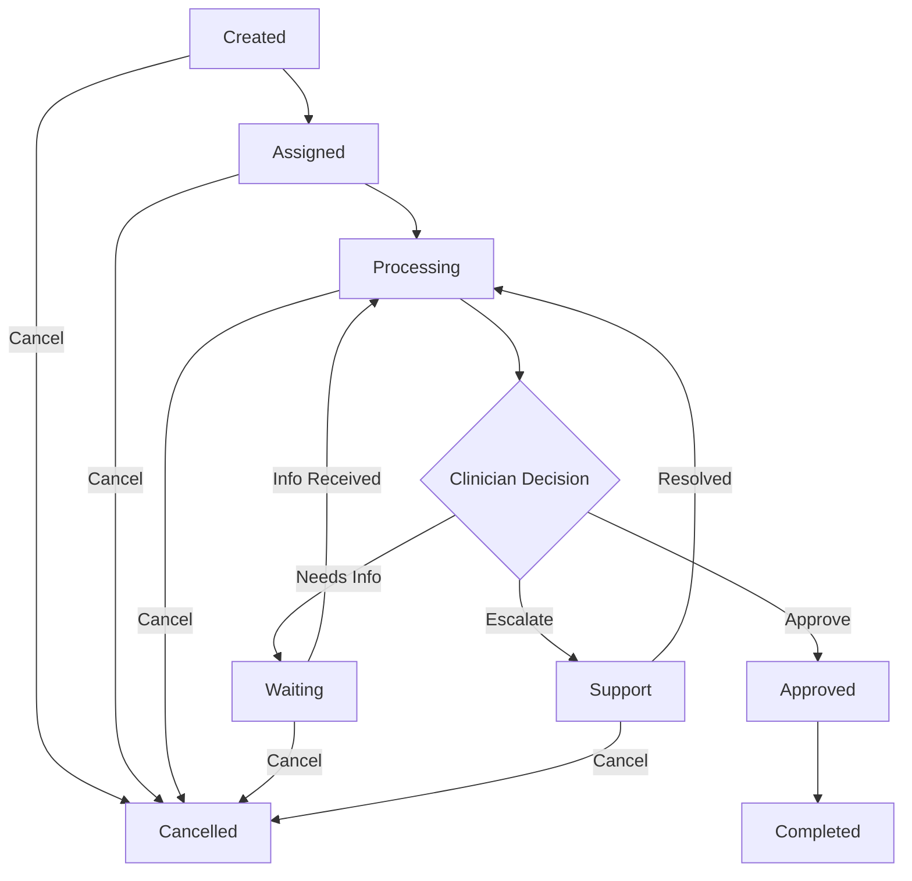

# Case Lifecycle

The case is the heart of MDI. Understanding how cases move through their lifecycle is essential to building a solid integration. This guide covers every status, every operation you can perform on a case, and the real-world scenarios you'll encounter.

## How a Case Moves Through the System

When you create a case (either directly or through a voucher), it enters a pipeline that looks like this:



Let's walk through each status and what it means for your integration.

### Created
The case has been submitted but no clinician has been assigned yet. MDI's assignment algorithm runs continuously, so cases typically don't stay in this status for more than a few minutes. You'll receive a `case_created` webhook.

### Assigned
A clinician has been matched to the case based on the patient's state, the treatment type, and the clinician's availability and specialties. The case is now in the clinician's queue. You'll receive a `case_assigned_to_clinician` webhook.

### Processing
The clinician is actively reviewing the case — reading questionnaire answers, looking at files, evaluating the patient's medical history, and deciding on treatment. This is where the clinical work happens. You'll receive a `case_processing` webhook.

### Waiting
The clinician needs additional information from the patient before they can make a decision. This could be an updated photo ID, more details about a medical condition, lab results, or clarification on a questionnaire answer. Your system should notify the patient and help them provide the requested information. You'll receive a `case_waiting` webhook and potentially workflow-specific webhooks like `drivers_license_requested` or `file_upload_requested`.

### Support
The case has been escalated to MDI's internal support team. This can happen for various reasons — complex medical situations, administrative issues, or questions about your partner configuration. MDI support handles these cases and moves them back to processing when resolved. You'll receive a `case_transferred_to_support` webhook.

### Approved
The clinician has reviewed and approved the case. Prescriptions are being prepared for submission to DoseSpot. You'll receive a `case_approved` webhook, and shortly after, `offering_submitted` webhooks as individual prescriptions are sent to the pharmacy.

### Completed
All prescriptions have been submitted to the pharmacy and confirmed. The case is done from MDI's perspective. You'll receive a `case_completed` webhook. At this point, order fulfillment begins — the pharmacy will dispense and ship the medication.

### Cancelled
The case was cancelled, either by you (the partner) or by the clinician. A cancelled case cannot be reactivated. You'll receive a `case_cancelled` webhook.

## Creating a Case (The Full Payload)

The create case endpoint accepts a rich payload. Here's the complete picture with every field:

<CodeGroup>

```bash cURL
curl -X POST https://api.mdintegrations.com/v1/partner/cases \
  -H "Content-Type: application/json" \
  -H "Authorization: Bearer TOKEN" \
  -d '{
    "patient_id": "a0299125-9d2e-4d73-831f-9f94d5950e86",
    "metadata": "Shopify #12345",
    "hold_status": false,
    "is_chargeable": true,
    "is_additional_approval_needed": false,
    "clinician_id": null,
    "reference_case_id": null,
    "case_offerings": [
      {
        "offering_id": "dbcc21c5-53d4-4da2-8cf6-7156563a035c",
        "product": {
          "dispense_unit": "tablet",
          "pharmacy_notes": "Patient prefers brand name.",
          "quantity": 30,
          "days_supply": 30,
          "directions": "Take one tablet by mouth daily in the morning."
        }
      }
    ],
    "case_questions": [
      {
        "question": "Are you currently pregnant or planning to become pregnant?",
        "answer": "false",
        "type": "boolean",
        "important": true,
        "is_critical": true,
        "display_in_pdf": true,
        "description": "Required for teratogenic medications",
        "label": "Pregnancy Status",
        "metadata": "intake-q-001",
        "displayed_options": ["yes", "no"]
      }
    ],
    "diseases": [
      {"disease_id": "0b333a71-8e31-4b5d-834c-27f724ac14ff"}
    ],
    "case_files": [
      "file-uuid-from-upload-endpoint"
    ],
    "tags": [
      {"id": "tag-uuid", "notes": "VIP customer"}
    ]
  }'
```

```python Python
import requests

case = requests.post(
    "https://api.mdintegrations.com/v1/partner/cases",
    json={
        "patient_id": "a0299125-9d2e-4d73-831f-9f94d5950e86",
        "metadata": "Shopify #12345",
        "hold_status": False,
        "is_chargeable": True,
        "is_additional_approval_needed": False,
        "case_offerings": [
            {
                "offering_id": "dbcc21c5-53d4-4da2-8cf6-7156563a035c",
                "product": {
                    "dispense_unit": "tablet",
                    "quantity": 30,
                    "days_supply": 30,
                    "directions": "Take one tablet by mouth daily in the morning."
                }
            }
        ],
        "case_questions": [
            {
                "question": "Are you currently pregnant?",
                "answer": "false",
                "type": "boolean",
                "important": True,
                "is_critical": True,
                "display_in_pdf": True,
                "label": "Pregnancy Status"
            }
        ],
        "diseases": [
            {"disease_id": "0b333a71-8e31-4b5d-834c-27f724ac14ff"}
        ],
        "case_files": []
    },
    headers={"Authorization": "Bearer TOKEN", "Content-Type": "application/json"}
)
case_data = case.json()
```

```javascript JavaScript
const response = await fetch("https://api.mdintegrations.com/v1/partner/cases", {
  method: "POST",
  headers: {
    "Authorization": "Bearer TOKEN",
    "Content-Type": "application/json"
  },
  body: JSON.stringify({
    patient_id: "a0299125-9d2e-4d73-831f-9f94d5950e86",
    metadata: "Shopify #12345",
    hold_status: false,
    is_chargeable: true,
    case_offerings: [{
      offering_id: "dbcc21c5-53d4-4da2-8cf6-7156563a035c",
      product: {
        dispense_unit: "tablet",
        quantity: 30,
        days_supply: 30,
        directions: "Take one tablet by mouth daily in the morning."
      }
    }],
    case_questions: [{
      question: "Are you currently pregnant?",
      answer: "false",
      type: "boolean",
      important: true,
      is_critical: true,
      display_in_pdf: true
    }]
  })
});
const caseData = await response.json();
```

```php PHP
<?php
$ch = curl_init("https://api.mdintegrations.com/v1/partner/cases");
curl_setopt($ch, CURLOPT_CUSTOMREQUEST, "POST");
curl_setopt($ch, CURLOPT_RETURNTRANSFER, true);
curl_setopt($ch, CURLOPT_HTTPHEADER, [
    "Authorization: Bearer $token",
    "Content-Type: application/json"
]);
curl_setopt($ch, CURLOPT_POSTFIELDS, json_encode([
    "patient_id" => "a0299125-9d2e-4d73-831f-9f94d5950e86",
    "metadata" => "Shopify #12345",
    "hold_status" => false,
    "is_chargeable" => true,
    "case_offerings" => [[
        "offering_id" => "dbcc21c5-53d4-4da2-8cf6-7156563a035c",
        "product" => [
            "dispense_unit" => "tablet",
            "quantity" => 30,
            "days_supply" => 30,
            "directions" => "Take one tablet by mouth daily in the morning."
        ]
    ]]
]));
$caseData = json_decode(curl_exec($ch), true);
curl_close($ch);
```

</CodeGroup>

### Create Case Field Reference

| Field | Type | Required | Description |
|-------|------|----------|-------------|
| `patient_id` | UUID | **Yes** | The patient this case is for. Must exist in your partner account. |
| `metadata` | string(255) | No | Your internal reference (order ID, etc.). Included in webhooks. |
| `hold_status` | boolean | No | If `true`, the case won't enter the clinician review flow until you release it. Default `false`. |
| `is_chargeable` | boolean | No | Whether the case should be billed. Default `true`. |
| `is_additional_approval_needed` | boolean | No | If the case requires an extra approval step before prescriptions are submitted. |
| `clinician_id` | UUID | No | Assign a specific clinician. If omitted, MDI assigns one automatically. |
| `reference_case_id` | UUID | No | Links this case to a previous case (for follow-ups). |
| `case_offerings` | array | No | Medications/compounds/supplies to prescribe. See below. |
| `case_questions` | array | No | Questionnaire answers. |
| `diseases` | array | No | ICD disease codes to attach. |
| `case_files` | array(UUID) | No | File IDs to attach (must be uploaded first via `POST /v1/partner/files`). |
| `tags` | array | No | Tags to categorize the case. |

## Querying Cases

### Get a specific case

```bash
curl -X GET https://api.mdintegrations.com/v1/partner/cases/CASE_ID \
  -H "Authorization: Bearer TOKEN"
```

Returns the full case including patient, clinician, offerings, status, and all timestamps.

### Search cases by status

This is how you find all cases in a given state. You can filter by partner, clinician, tags, diseases, state, case type, and more:

<CodeGroup>

```bash cURL
curl -X POST https://api.mdintegrations.com/v1/partner/cases/status/processing \
  -H "Content-Type: application/json" \
  -H "Authorization: Bearer TOKEN" \
  -d '{
    "sort": "desc",
    "case_type": "New",
    "tags": [],
    "partners": [],
    "clinicians": [],
    "states": [],
    "diseases": []
  }'
```

```python Python
import requests

cases = requests.post(
    "https://api.mdintegrations.com/v1/partner/cases/status/processing",
    json={"sort": "desc", "case_type": "New"},
    headers={"Authorization": "Bearer TOKEN", "Content-Type": "application/json"}
)
for case in cases.json()["data"]:
    print(f"{case['case_id']}: {case['case_status']['name']}")
```

```javascript JavaScript
const response = await fetch("https://api.mdintegrations.com/v1/partner/cases/status/processing", {
  method: "POST",
  headers: { "Authorization": "Bearer TOKEN", "Content-Type": "application/json" },
  body: JSON.stringify({ sort: "desc", case_type: "New" })
});
const { data } = await response.json();
data.forEach(c => console.log(`${c.case_id}: ${c.case_status.name}`));
```

```php PHP
<?php
$ch = curl_init("https://api.mdintegrations.com/v1/partner/cases/status/processing");
curl_setopt($ch, CURLOPT_CUSTOMREQUEST, "POST");
curl_setopt($ch, CURLOPT_RETURNTRANSFER, true);
curl_setopt($ch, CURLOPT_HTTPHEADER, [
    "Authorization: Bearer $token",
    "Content-Type: application/json"
]);
curl_setopt($ch, CURLOPT_POSTFIELDS, json_encode(["sort" => "desc", "case_type" => "New"]));
$cases = json_decode(curl_exec($ch), true);
curl_close($ch);
```

</CodeGroup>

Valid status values: `created`, `assigned`, `processing`, `waiting`, `support`, `approved`, `completed`, `cancelled`.

### Get case count by status

Get a quick overview of how many cases are in each status without pulling the full list:

```bash
curl -X GET https://api.mdintegrations.com/v1/partner/statistics/count/cases-by-status \
  -H "Authorization: Bearer TOKEN"
```

## Managing Case Status

### Cancel a case

```bash
curl -X POST https://api.mdintegrations.com/v1/partner/cases/CASE_ID/cancel \
  -H "Content-Type: application/json" \
  -H "Authorization: Bearer TOKEN" \
  -d '{"reason": "Patient requested cancellation"}'
```

The `reason` is optional but helpful for the clinician and your own records.

### Escalate to support

```bash
curl -X POST https://api.mdintegrations.com/v1/partner/cases/CASE_ID/support \
  -H "Content-Type: application/json" \
  -H "Authorization: Bearer TOKEN" \
  -d '{"reason": "Patient has complex medication interactions"}'
```

### Update hold status

```bash
curl -X PATCH https://api.mdintegrations.com/v1/partner/cases/CASE_ID/status \
  -H "Content-Type: application/json" \
  -H "Authorization: Bearer TOKEN" \
  -d '{"on_hold": true}'
```

Set `on_hold` to `false` to release the case back into the clinician review flow.

## Working with Offerings

Offerings on a case represent the medications, compounds, or supplies being requested. You can add, update, and remove offerings after case creation.

### List offerings on a case

```bash
curl -X GET https://api.mdintegrations.com/v1/partner/cases/CASE_ID/offerings \
  -H "Authorization: Bearer TOKEN"
```

### Add an offering

```bash
curl -X POST https://api.mdintegrations.com/v1/partner/cases/CASE_ID/offerings \
  -H "Content-Type: application/json" \
  -H "Authorization: Bearer TOKEN" \
  -d '{
    "offering_id": "dbcc21c5-53d4-4da2-8cf6-7156563a035c",
    "product": {
      "quantity": 30,
      "days_supply": 30,
      "directions": "Take one tablet daily"
    }
  }'
```

### Update an offering

```bash
curl -X PATCH https://api.mdintegrations.com/v1/partner/cases/CASE_ID/offerings/OFFERING_ID \
  -H "Content-Type: application/json" \
  -H "Authorization: Bearer TOKEN" \
  -d '{"product": {"quantity": 60, "days_supply": 60}}'
```

### Remove an offering

```bash
curl -X DELETE https://api.mdintegrations.com/v1/partner/cases/CASE_ID/offerings/OFFERING_ID \
  -H "Authorization: Bearer TOKEN"
```

## Case Files, Notes, and Tags

### Attach a file to a case

Files must be uploaded first (see [Files & Pharmacies](/files-and-pharmacies)), then attached:

```bash
curl -X POST https://api.mdintegrations.com/v1/partner/cases/CASE_ID/files/FILE_ID \
  -H "Authorization: Bearer TOKEN"
```

### Add a clinical note

```bash
curl -X POST https://api.mdintegrations.com/v1/partner/cases/CASE_ID/notes \
  -H "Content-Type: application/json" \
  -H "Authorization: Bearer TOKEN" \
  -d '{"text": "Patient reports improvement after 2 weeks on current dosage."}'
```

### Attach a tag

```bash
curl -X POST https://api.mdintegrations.com/v1/partner/cases/CASE_ID/tags/TAG_ID \
  -H "Content-Type: application/json" \
  -H "Authorization: Bearer TOKEN" \
  -d '{"notes": "VIP customer — expedite review"}'
```

## Case Events

Every action on a case is logged as an event. This is your audit trail:

```bash
curl -X GET "https://api.mdintegrations.com/v1/partner/cases/CASE_ID/events?page=1&per_page=25" \
  -H "Authorization: Bearer TOKEN"
```

## Downloading PDFs

### Case prescriptions PDF

```bash
curl -X GET https://api.mdintegrations.com/v1/partner/cases/CASE_ID/pdf \
  -H "Authorization: Bearer TOKEN"
```

### Case offerings PDF

```bash
curl -X GET https://api.mdintegrations.com/v1/partner/cases/CASE_ID/offerings/pdf \
  -H "Authorization: Bearer TOKEN"
```
